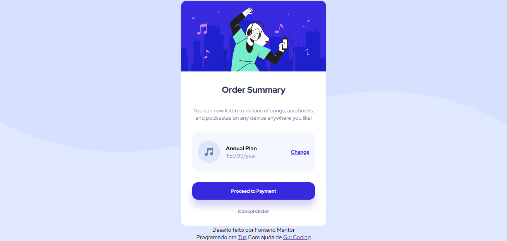

# Frontend Mentor - Order summary card solution

This is a solution to the [Order summary card challenge on Frontend Mentor](https://www.frontendmentor.io/challenges/order-summary-component-QlPmajDUj). Frontend Mentor challenges help you improve your coding skills by building realistic projects. 

## Table of contents

- [Overview](#overview)
  - [Screenshot](#screenshot)
  - [Links](#links)
- [My process](#my-process)
  - [Built with](#built-with)
- [Author](#author)

## Overview

A Frontend Mentor project to replicate a given design with only CSS and HTML.

### Screenshot

### Links

- Solution URL: (https://www.frontendmentor.io/challenges/order-summary-component-QlPmajDUj/hub)
- Live Site URL: (https://tusnu.github.io/frontend-challenge-order-summary/)
- Girl Coding channel: (https://www.youtube.com/@GirlCoding)

## My process

I admit that I was only able to complete this challenge with the help of Girl Coding, but it was a good experience trying to do it.

### Built with

- Semantic HTML5 markup
- CSS custom properties
- Flexbox

## Author

- Website - Gabriel L. (https://github.com/Tusnu)
- Frontend Mentor - Tusnu (https://www.frontendmentor.io/profile/Tusnu)
